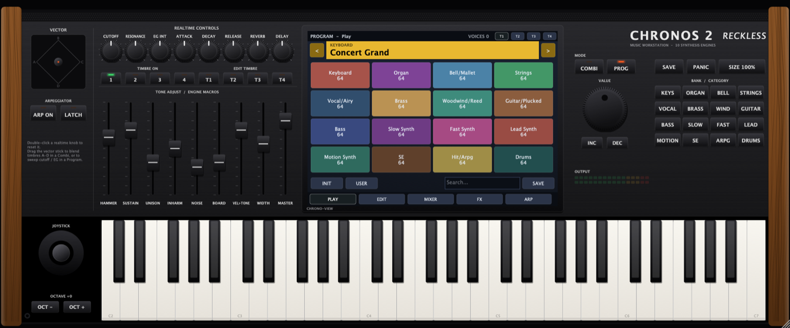
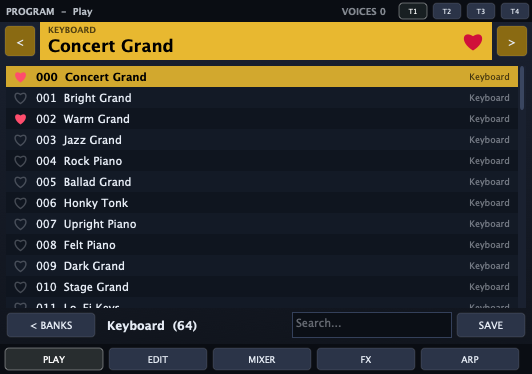
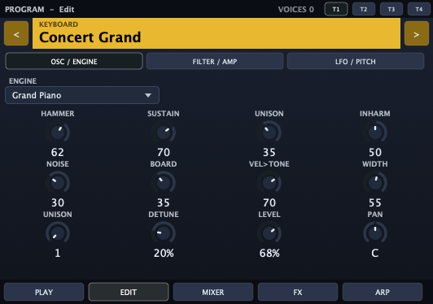
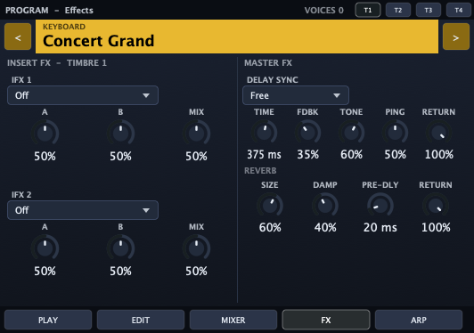
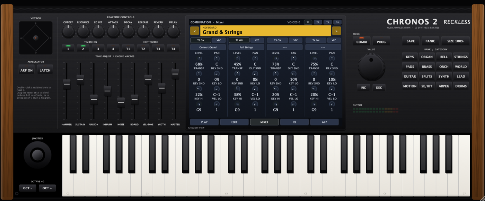

# Reckless Chronos 2

**Synthé workstation gratuit et open source (VST3 / AU / Standalone), inspiré de la fiche produit d'une grande workstation musicale.**
10 moteurs de synthèse, mode Program + Combi (4 timbres), joystick vectoriel, arpégiateur, 2 effets d'insertion par timbre, delay et reverb master, interface redimensionnable de 50 % à 200 %, et **1024 Programs + 130 Combis** d'usine.

> *English: a free workstation synth plugin (VST3/AU/Standalone) with 10 synthesis engines, combis, vector joystick,
> arpeggiator, resizable UI and 1154 factory presets. Built with JUCE, licensed AGPLv3.*



---

## Ce que contient le plugin

| Fiche produit de la workstation d'origine | Dans Reckless Chronos 2 |
|---|---|
| Piano à queue échantillonné (SGX-2) | **Grand Piano** : piano modélisé (synthèse modale, cordes doublées désaccordées, inharmonicité, bruit de marteau, table d'harmonie) |
| Piano électrique modélisé (EP-1) | **Electric Piano** : modèle tine ↔ reed, non-linéarité du micro, cloche, trémolo / auto-pan stéréo |
| Moteur PCM (HD-1) | **Wave ROM** : 24 formes d'onde band-limitées (cordes, cuivres, chœurs, bois, verre, digital…) avec morphing A↔B, souffle, chiff. **Drum Kit** : batterie synthétisée selon la répartition GM |
| Orgue à roues phoniques (CX-3) | **Tonewheel Organ** : 9 tirettes (7 macros), percussion, clic, foldback, avec effet **Rotary** |
| Synthé analogique virtuel (AL-1) | **Analog** : 2 oscillateurs morphables, sub, bruit, unisson ×4, filtre ladder |
| Cordes à modélisation physique (STR-1) | **Plucked String** : Karplus-Strong étendu (position de pincement, raideur, caisse, mode archet) |
| FM / VPM (MOD-7) | **FM Matrix** : 4 opérateurs, 8 algorithmes, feedback, ratios harmoniques et inharmoniques |
| Émulation MS-20 | **Twin Filter** : 2 VCO, HPF résonant + LPF qui « crie » |
| Émulation Polysix | **Vintage Poly** : saw / pulse / PWM, sub, dérive analogique, ensemble |

**Pour chaque timbre** : filtre multimode (LP12, LP24, Ladder, MS-LP, BP, HP), deux enveloppes ADSR, un LFO à 5 formes, une enveloppe de hauteur, glide et modes poly / mono / legato, 2 effets d'insertion parmi 14 types (Chorus, Ensemble, Flanger, Phaser, Tremolo, Auto Pan, Rotary, Overdrive, Amp Sim, Compressor, Tone EQ, Auto Wah, Lo-Fi, Delay), plus des départs vers le delay et la reverb master.

**Combi** : jusqu'à 4 timbres en layer ou en split, avec zones de clavier et de vélocité. Le **joystick vectoriel** mixe les timbres A, B, C et D. En mode Program, il pilote le cutoff et l'intensité de l'enveloppe.

**Contrôles temps réel** (8 potards du panneau) : décalages globaux de Cutoff, Résonance, EG Int, Attack, Decay, Release, Reverb et Delay. Les **9 faders** correspondent aux 8 macros du moteur (les tirettes en mode orgue) plus le volume master.

**Arpégiateur** : modes Up, Down, Up-Down, Random, As Played et Chord, de 1/4 à 1/32 en triolets, 1 à 4 octaves, gate, swing et latch. Il se synchronise sur le tempo de l'hôte.

## Interface

Le design reprend le panneau de la workstation : joues en bois, potards et faders, écran tactile central à tuiles colorées, pavé de banques et grand encodeur VALUE, joystick et clavier de 61 touches jouable à la souris.

- **Taille réglable** : tire le coin en bas à droite (le ratio est conservé) ou utilise le bouton **SIZE**, de 50 % à 200 %. La taille est mémorisée avec le projet.
- **Écran** : 5 pages.
  - **PLAY** : banques par catégorie, liste et recherche, favoris ♥, sauvegarde.
  - **EDIT** : moteur, filtre et amplitude, LFO et hauteur.
  - **MIXER** : 4 timbres.
  - **FX** : effets d'insertion et effets master.
  - **ARP** : arpégiateur.

<p>
  
</p>



## Presets

| Programs (64 par catégorie) | Combis (130) |
|---|---|
| Keyboard, Organ, Bell/Mallet, Strings, Vocal/Airy, Brass, Woodwind/Reed, Guitar/Plucked, Bass, Slow Synth, Fast Synth, Lead Synth, Motion Synth, SE, Hit/Arpg, Drums | Keyboard, Organ, Bell/Mallet, Strings, Pads, Brass/Reed, Orchestral, World, Guitar, Bass Splits, Synth, Lead, Motion, SE/Hits, Arpeggio, Drums/Splits |

Les presets sont générés par [`tools/preset_gen.py`](tools/preset_gen.py) à partir d'environ 250 recettes écrites à la main. Chaque recette est déclinée en variantes (Hall, Room, Chorus, Drive, Glide, Dark, Bright…), et les niveaux sont équilibrés automatiquement à partir d'une mesure de loudness.

**Favoris** : clique sur le **♥** dans la barre du nom ou devant un preset dans une liste. La banque **♥ FAVORITES** de la page PLAY rassemble tous tes presets likés (Programs et Combis séparément), dans l'ordre où tu les as likés. On les retrouve aussi dans le menu d'assignation du MIXER. Les likes sont enregistrés dans `favorites.json`, dans le dossier utilisateur ci-dessous, et partagés entre toutes les instances du plugin.

Tes propres presets (bouton **SAVE**) sont enregistrés ici :
- macOS : `~/Library/Audio/Presets/Reckless/Reckless Chronos 2/`
- Windows : `%APPDATA%\Reckless\Reckless Chronos 2\`

Ils apparaissent dans la banque **USER**.

## Installation

Télécharge la dernière version dans [Releases](../../releases), ou l'artefact du dernier build dans l'onglet **Actions**.

- **macOS, VST3** : copie `Reckless Chronos 2.vst3` dans `~/Library/Audio/Plug-Ins/VST3/`.
- **macOS, AU** : copie `Reckless Chronos 2.component` dans `~/Library/Audio/Plug-Ins/Components/`.
- **Windows, VST3** : copie `Reckless Chronos 2.vst3` dans `C:\Program Files\Common Files\VST3\`.

Les binaires ne sont pas signés. Sur macOS, si le plugin est bloqué, retire l'attribut de quarantaine :

```bash
xattr -dr com.apple.quarantine ~/Library/Audio/Plug-Ins/Components/"Reckless Chronos 2.component" ~/Library/Audio/Plug-Ins/VST3/"Reckless Chronos 2.vst3"
```

## Compiler soi-même

Prérequis : CMake 3.22 ou plus, un compilateur C++20 (Xcode ou Command Line Tools sur macOS, Visual Studio 2022 ou plus récent sur Windows) et Git. JUCE 8 est téléchargé automatiquement.

```bash
cmake -B build -DCMAKE_BUILD_TYPE=Release
cmake --build build --config Release
```

Les plugins sont générés dans `build/RecklessChronos2_artefacts/Release/` (dossiers `VST3/`, `AU/` et `Standalone/`).

### Tests

```bash
./build/RC2Tests_artefacts/Release/RC2Tests --pitch          # joue les 1154 presets : silence, NaN, saturation, justesse
./build/RC2Tests_artefacts/Release/RC2Tests --wav renders    # exporte un .wav de démo par Program
./build/RC2Tests_artefacts/Release/RC2Tests --host "build/RecklessChronos2_artefacts/Release/VST3/Reckless Chronos 2.vst3"
auval -v aumu Rch2 Rckl                                      # validation Apple de l'AU (une fois installé)
```

La CI GitHub Actions compile macOS (binaire universel) et Windows. Elle lance les tests de rendu, `auval` et [pluginval](https://github.com/Tracktion/pluginval), puis publie les zips quand un tag `v*` est poussé.

### Régénérer les presets

```bash
python3 tools/preset_gen.py              # écrit Presets/factory.json (niveaux équilibrés)
```

Si tu modifies les gains d'un moteur, re-mesure les niveaux :

```bash
python3 tools/preset_gen.py --no-levels
cmake --build build --target RC2Tests
./build/RC2Tests_artefacts/Release/RC2Tests --loudness tools/measured_levels.csv
python3 tools/preset_gen.py
```

## Limites, en toute honnêteté

- Il n'y a **aucun échantillon** : tout est synthétisé. Le piano et les instruments acoustiques sont des modèles, crédibles mais pas au niveau d'une banque samplée de plusieurs gigaoctets.
- Le Combi gère 4 timbres (contre 16 sur la machine d'origine). Il n'y a ni séquenceur, ni sampling, ni KARMA.
- Les binaires ne sont pas signés ni notarisés.

## Mentions légales

Projet indépendant et non officiel. **Il n'est ni affilié à Korg Inc., ni approuvé par elle.** « Kronos » et « Korg » sont des marques de Korg Inc., citées uniquement pour décrire l'inspiration du projet. Aucun échantillon, code ou élément graphique d'origine n'est utilisé.

Licence **GNU AGPLv3** (voir [LICENSE](LICENSE)), compatible avec la licence open source de [JUCE](https://juce.com).
